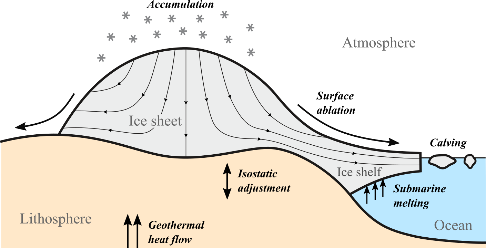
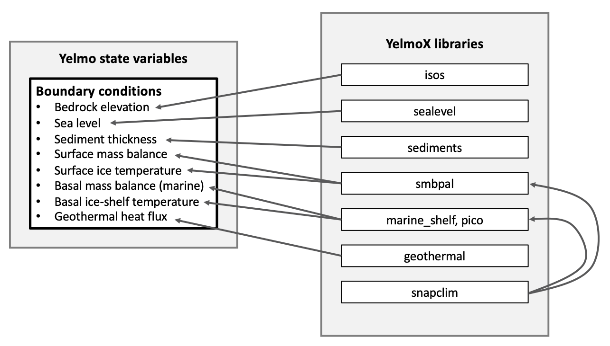

# Running with YelmoX

YelmoX is a separate repository that is designed to provide supplementary libraries and programs that allow running ice-sheet simulations with realistic boundary (e.g., climate and ocean) forcing and interactions (e.g., isostatic rebound).





Here you can find the basic information and steps needed to get **YelmoX** running.

## Super-quick start

A summary of commands to get started is given below. Make sure all [Dependencies](dependencies.md) are installed and that you follow the [HPC notes](hpc-notes.md)!

Also note, below it is assumed that you are setting up on the `pik_hpc2024` system. If not, make sure to specify the config file for your own system, as well as the locations of `ice_data` and `isostasy_data` (see [HPC notes](hpc-notes.md)).

```bash

# yelmox
git clone git@github.com:palma-ice/yelmox.git
cd yelmox
python3 config.py config/pik_hpc2024_ifx 

# yelmo
git clone git@github.com:palma-ice/yelmo.git
cd yelmo
python3 config.py config/pik_hpc2024_ifx
ln -s $FESMUSRC ./libs/
cd ..

# FastIsostasy
git clone git@github.com:palma-ice/FastIsostasy.git
cd FastIsostasy
python3 config.py config/pik_hpc2024_ifx
ln -s $FESMUSRC ./
cd ..

# coordinates
git clone git@github.com:cxesmc/coordinates.git
cd coordinates
COORDSRC=$PWD
python3 config.py config/pik_hpc2024_ifx 
cd ..

# REMBOv1
git clone git@github.com:alex-robinson/rembo1.git
cd rembo1
python3 config.py config/pik_hpc2024_ifx
ln -s $FESMUSRC ./libs/
ln -s $COORDSRC ./
cd ..

# Now, compile the default program
make clean 
make yelmox 

# Link to `ice_data` and `isostasy_data` repositories wherever you have them saved on your system
datapath=/p/projects/megarun
ln -s $datapath/ice_data
ln -s $datapath/isostasy_data

# Copy the runme config file to the main directory and modify for your system
cp .runme/runme_config .runme_config

# Run a test simulation of Antarctica for 1000 yrs
./runme -r -e yelmox -n par/yelmo_Antarctica.nml -o output/ant-test -p ctrl.time_end=1e3
```

That's it!
